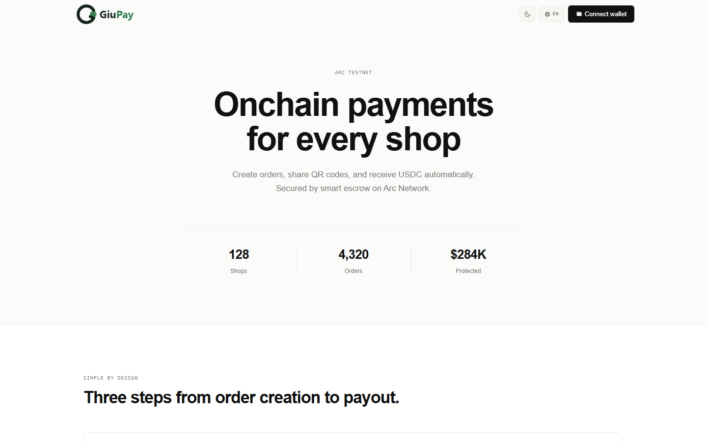
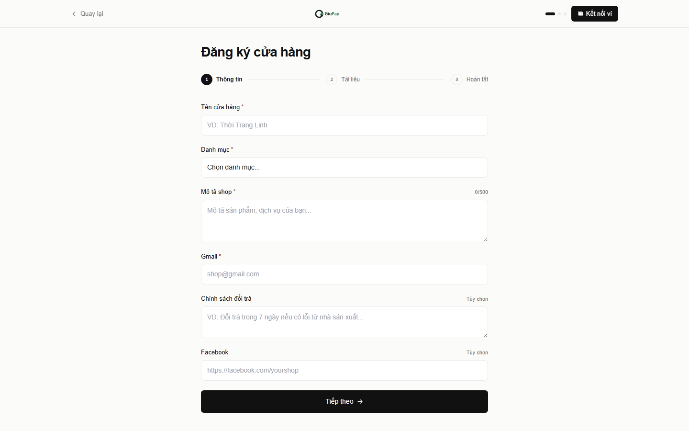
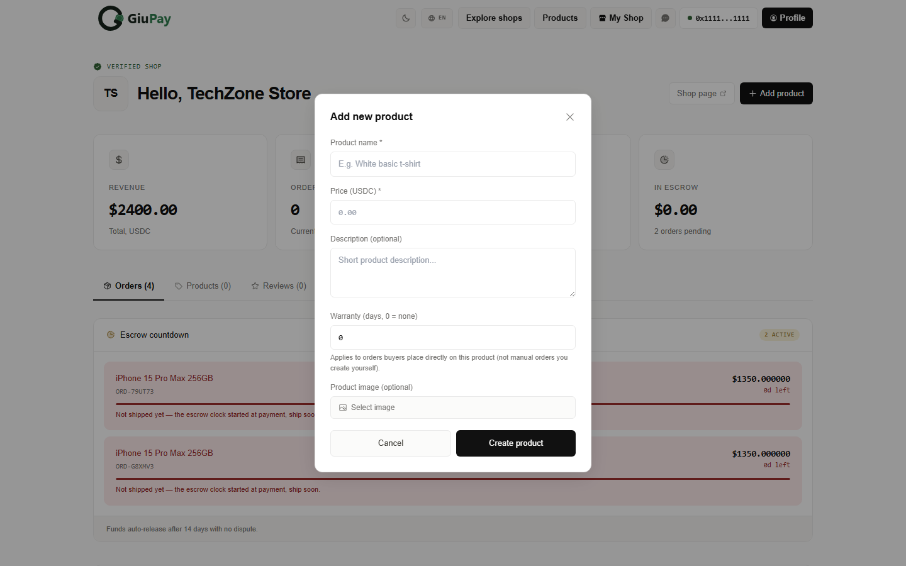
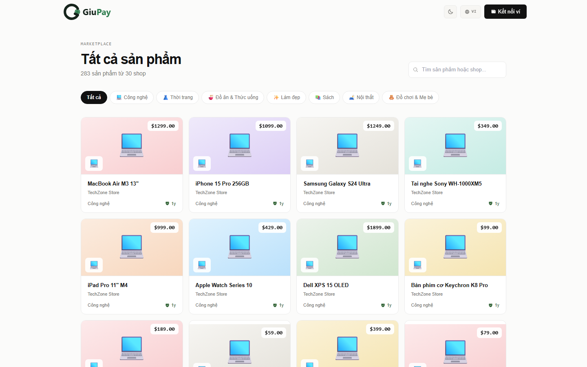
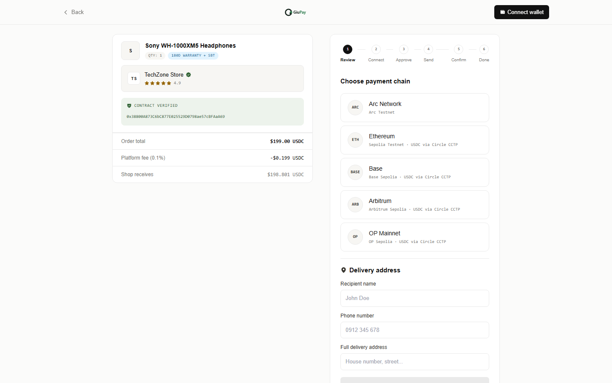
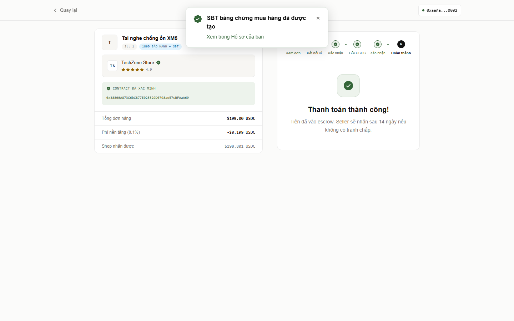
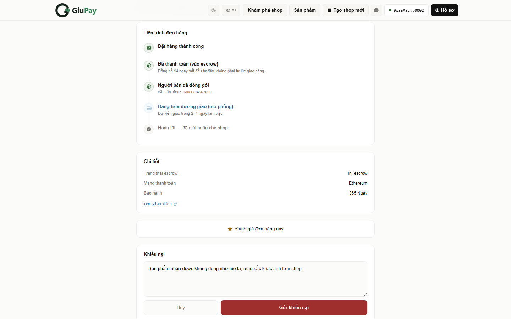
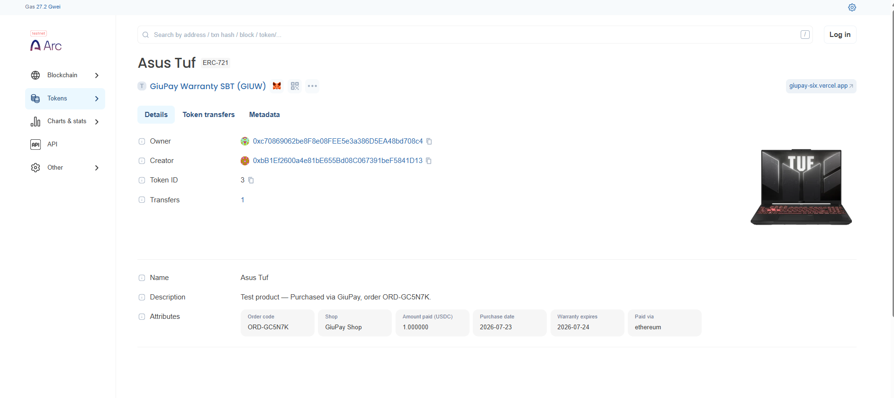

# GiuPay

**Decentralized escrow payment dApp on Arc Testnet.**

GiuPay lets any shop accept USDC payments on-chain with buyer protection built in: funds sit in a smart-contract escrow for 14 days, disputes can be opened and resolved on-chain, and every completed purchase mints a soulbound warranty NFT as proof of purchase.

---

## Live demo

🚀 [giupay-six.vercel.app](https://giupay-six.vercel.app)

## Screenshots

**1. Homepage**

Landing page — live stats (shops, orders, USDC protected) and the core pitch: on-chain escrow payments for any shop.

**2. Shop creation form**

Any wallet can register a shop in a few fields. Admin reviews identity (email + 2FA) before it goes live and gets confirmed on-chain via `ShopRegistry`.

**3. Seller adds a product**

From the shop dashboard, a seller lists a new product — price, warranty period, and optional image — which becomes instantly purchasable by buyers.

**4. Buyer browsing products**

A marketplace view across every verified shop, filterable by category, so buyers can shop without needing a direct link.

**5. Multi-chain payment**

Buyers pay in USDC directly on Arc, or bridge in from Ethereum, Base, Arbitrum, or OP via Circle's CCTP — the funds land straight in escrow either way.

**6. SBT minted after payment**

The moment escrow confirms, a soulbound warranty NFT is minted automatically as proof of purchase — no extra signature needed from the buyer.

**7. Buyer opens a dispute**

If something's wrong after shipping, the buyer can open a dispute any time within the 14-day escrow window, with the shop given a window to respond or refund on-chain.

**8. Warranty SBT verified on-chain**

Every SBT is a real ERC-721 on Arc, verifiable on the block explorer — full metadata (order code, shop, amount paid, purchase date, warranty expiry, payment chain) minted on-chain, not just displayed in the app.

## Demo video

[▶️ Watch the full walkthrough](https://github.com/user-attachments/assets/3b522003-f536-4578-b299-5721b7573e7a)

Full user journey in one take: seller registers a shop and lists a product, a buyer browses and reads reviews, pays via multi-chain checkout (bridging USDC in from Ethereum through Circle's CCTP), leaves a review, and gets a warranty SBT minted straight to their profile — then the seller ships the order and a dispute gets opened.

## What it does

- **Shop onboarding** — register a shop, admin verifies identity (email + 2FA) and confirms it on-chain via `ShopRegistry`.
- **On-chain escrow payments** — buyers pay in USDC directly on Arc, or bridge in from Ethereum / Base / Arbitrum / OP Sepolia via **Circle's CCTP**, landing straight into escrow.
- **14-day buyer protection** — funds auto-release to the shop after 14 days if no dispute is raised.
- **On-chain dispute resolution** — buyer opens a dispute, the shop can agree to refund (signs on-chain themselves), or an admin steps in to resolve.
- **Warranty SBT** — a soulbound ERC-721 is minted automatically once payment clears, acting as verifiable proof of purchase + warranty period. It burns itself once the warranty window expires.
- **Buyer ↔ shop chat** and **reviews** for every completed order.

## Tech stack

| Layer | Stack |
|---|---|
| Frontend | Next.js, wagmi + viem, RainbowKit |
| Backend | Node.js, Express, PostgreSQL |
| Smart contracts | Solidity (Hardhat), OpenZeppelin |
| Storage | IPFS (Pinata) |
| Payments | Native USDC on Arc, Circle CCTP for cross-chain bridging |

## Deployed contracts (Arc Testnet)

All verified and viewable on [Arc Explorer](https://testnet.arcscan.app):

| Contract | Address |
|---|---|
| ShopRegistry | `0x6E18Ba8Ce0841Ff58831629a5dd34AE37932cd6b` |
| PaymentEscrow | `0x38800A873C6bC877E025529D0798ae57cBFAaA69` |
| WarrantySBT | `0x2460C32eDA3134bCF3e284455Ed64d8c68F831C9` |

## Status

🚧 Testnet build, actively developed.

## Contact

Built by [@QuyTu9868](https://github.com/QuyTu9868).
